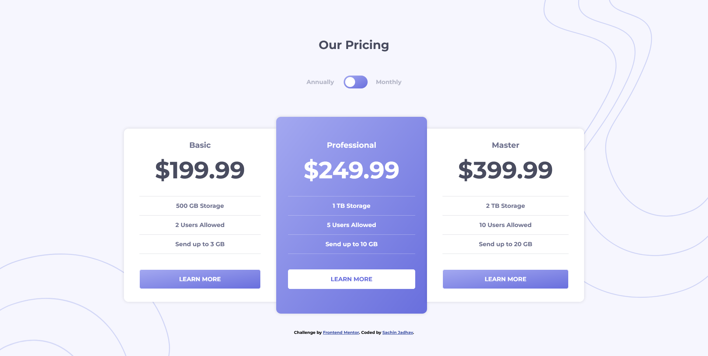

# Frontend Mentor - Pricing component with toggle solution

This is a solution to the [Pricing component with toggle challenge on Frontend Mentor](https://www.frontendmentor.io/challenges/pricing-component-with-toggle-8vPwRMIC). Frontend Mentor challenges help you improve your coding skills by building realistic projects. 

## Table of contents

- [Overview](#overview)
  - [The challenge](#the-challenge)
  - [Screenshot](#screenshot)
  - [Links](#links)
- [My process](#my-process)
  - [Built with](#built-with)
  - [What I learned](#what-i-learned)
  - [Continued development](#continued-development)
  - [Useful resources](#useful-resources)
- [Author](#author)
- [Acknowledgments](#acknowledgments)

## Overview

### The challenge

Users should be able to:

- View the optimal layout for the component depending on their device's screen size
- Control the toggle with both their mouse/trackpad and their keyboard
- **Bonus**: Complete the challenge with just HTML and CSS

### Screenshot



### Links

- Solution URL: https://github.com/Sachin9328/pricing-component-with-toggle
- Live Site URL: https://sachin9328.github.io/pricing-component-with-toggle/

## My process

### Built with

- HTML5 markup
- CSS custom properties
- Flexbox
- CSS Grid
- Javascript
- Mobile-first workflow

### What I learned

- CSS not() property, last-child selector and grid-template-areas property

```css
.card > div:not(:last-child) {
    border-bottom: 1px solid rgba(183, 184, 194, 0.45);
}

.card-inverse > div:not(:last-child) {
    border-bottom: 1px solid rgba(255, 255, 255, 0.35);
}

.container {
    display: grid;   
    grid-template-areas: 
        "header header header"
        "basic professional master"
        "attribution attribution attribution"; 
    align-items: center;
    width: 65%;
}
```

- Javascript toggle() method
```js
toggler.addEventListener("click", () => {
    container.classList.toggle("monthly", toggler.checked);
});
```

### Continued development

- Focusing on getting better at using different Javascript methods and properties to come up with optimized functionality

### Useful resources

- [All-CSS Toggle Switch (Checkbox Hack) by Marcus Burnette](https://codepen.io/mburnette/pen/LxNxNg) - Used this toggle switch and changed it a bit.

## Author

- Github - [@Sachin9328](https://github.com/Sachin9328)
- Frontend Mentor - [@Sachin9328](https://www.frontendmentor.io/profile/Sachin9328)
- Linkedin - [Sachin Jadhav](https://www.linkedin.com/in/sachin-jadhav2893/)

## Acknowledgments

- [T.J. Crowder](https://stackoverflow.com/users/157247/t-j-crowder) on stackoverflow helped me come up with a more optimized way to change content when user toggles between annual and monthly.
